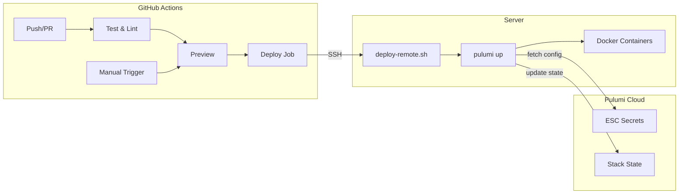
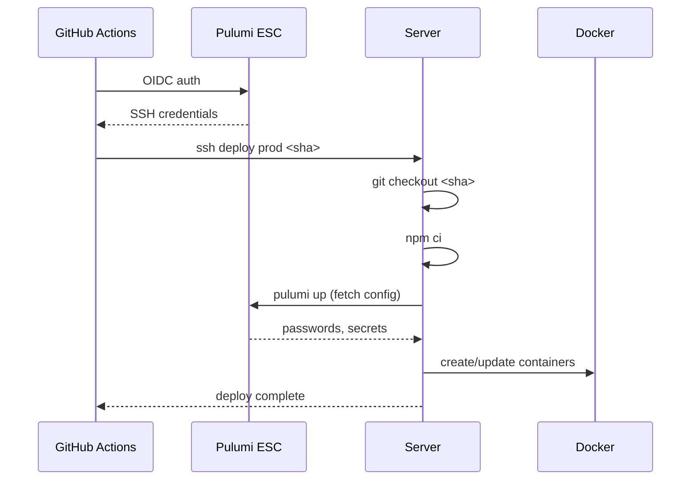

# Deployment Guide

## Architecture



## CI/CD Flow

| Trigger | Action | Where |
|---------|--------|-------|
| PR / Push to master | `pulumi preview` | GitHub Runner |
| Manual dispatch | SSH → `pulumi up` | Server |

Docker images are built on the server (`skipPush: true`), so deploy must run there.

## Deploy Sequence



## Setup

### 1. Server Bootstrap

```bash
curl -fsSL https://raw.githubusercontent.com/<org>/gatrr/master/scripts/server-bootstrap-ubuntu.sh | sudo bash
```

Or with full setup:

```bash
sudo ./server-bootstrap-ubuntu.sh \
  --pulumi-key /path/to/pulumi.key \
  --repo https://github.com/<org>/gatrr.git \
  --stack prod \
  --deploy-key /path/to/deploy.pub
```

### 2. Pulumi ESC Environment

Create `gatrr/prod` in Pulumi Cloud with your secrets. See `infra/pulumi/esc.prod.yaml` for template.

### 3. GitHub Actions Variables

| Variable | Example |
|----------|---------|
| `PULUMI_ORG` | `YourOrg` |
| `PULUMI_USER` | `YourUsername` |

| Secret | Description |
|--------|-------------|
| `PULUMI_CONFIG_PASSPHRASE` | Empty (secrets in ESC) |

### 4. OIDC Setup

In Pulumi Cloud → Settings → OIDC Issuers:
- **Issuer URL**: `https://token.actions.githubusercontent.com`
- **Token Type**: `personal`
- **Sub**: `repo:YourOrg/gatrr:*`
- **Aud**: `urn:pulumi:org:YourOrg`

## Triggering Deploys

1. Go to **Actions** → **CI/CD**
2. Click **Run workflow**
3. Select `master` branch
4. Click **Run workflow**

## Rollback

Deploy a previous commit SHA:

```bash
# Via GitHub Actions (enter SHA in workflow dispatch)
# Or directly on server:
sudo -u deployer /data/gatrr/scripts/deploy-remote.sh prod <previous-sha>
```

## Updating Secrets

1. Update passwords in Pulumi ESC (`gatrr/prod`)
2. Trigger deploy
3. Keycloak restarts automatically (config hash changes)

## Logs

```bash
# On server
ls -lt /var/log/gatrr/
tail -f /var/log/gatrr/deploy-prod-*.log
```

## Security

- SSH uses forced command (only `deploy <stack> <sha>` allowed)
- OIDC auth (no long-lived tokens in GitHub)
- Secrets masked in GitHub logs (`::add-mask::`)
- UFW firewall: only Cloudflare IPs on 80/443
